# Castelmare — Sicily upgrade for Place1

Replaces the cowboy map with a generated **Sicilian seaside town**, switches every character (players and NPCs) to **blocky R6**, and adds **weighty third-person movement**: a relaxed walk, Shift to run, a cinematic camera and procedural animation.

The countryside has **wild horses** to tame and ride, and every player carries **western guns** that work on foot and at a full gallop.

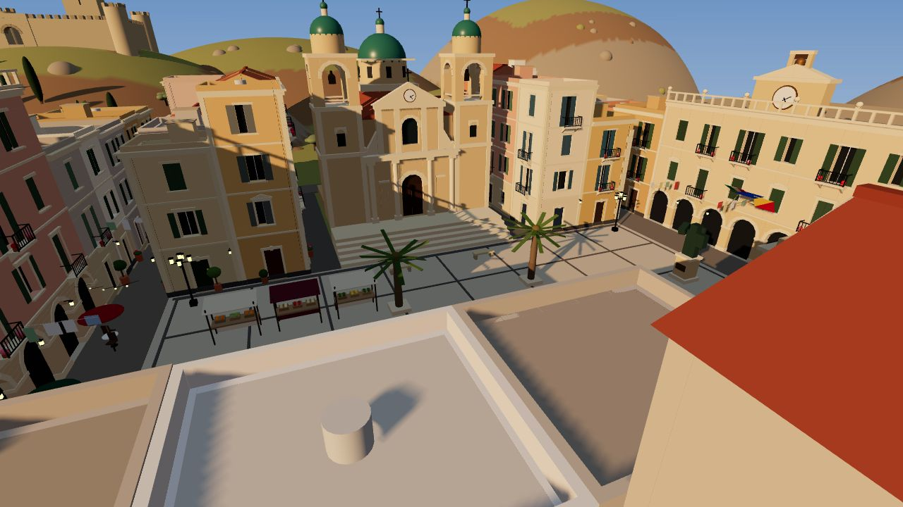

| | |
|---|---|
| 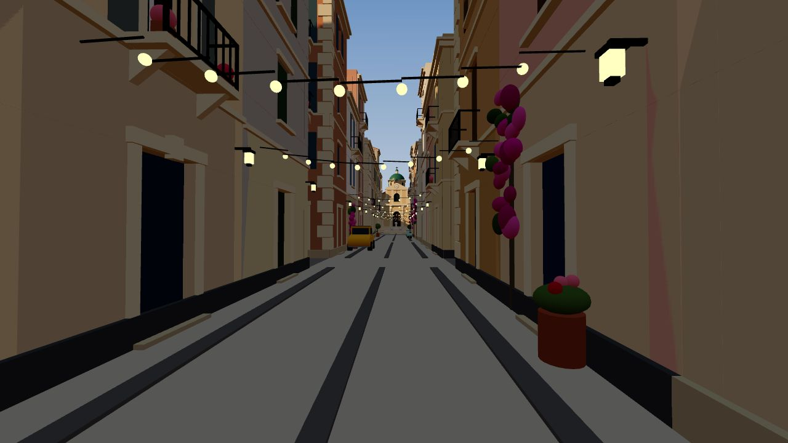 | 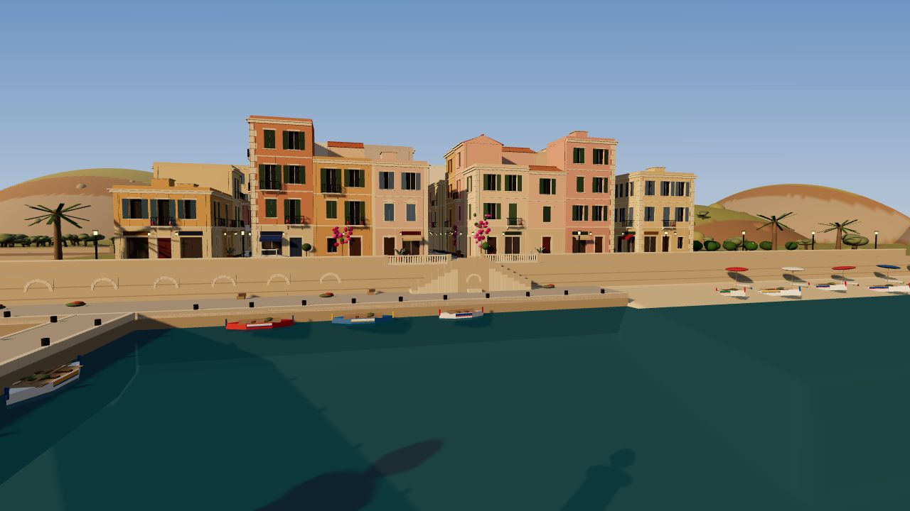 |
| 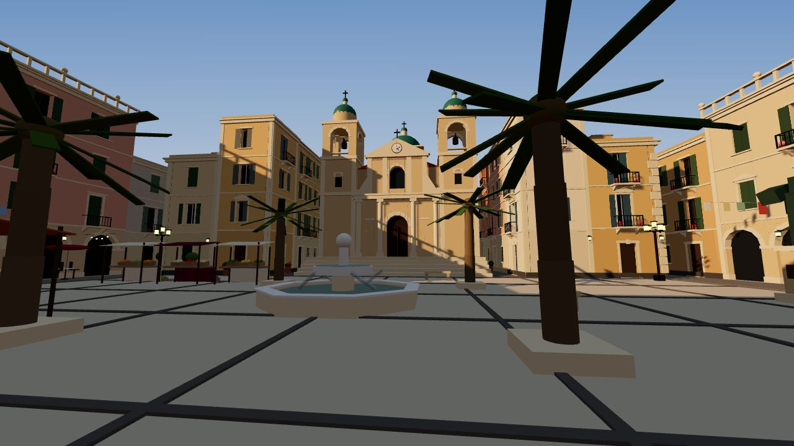 | 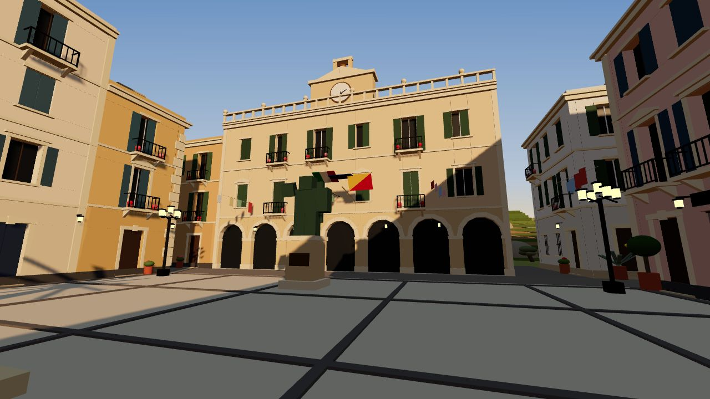 |
| 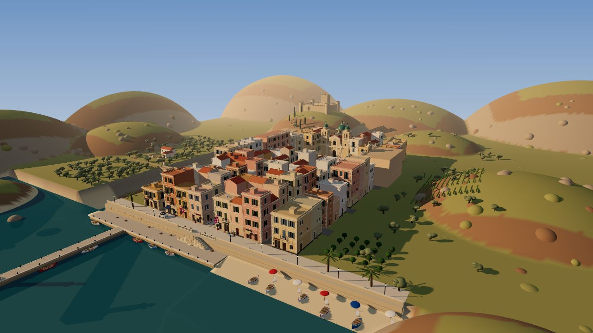 | 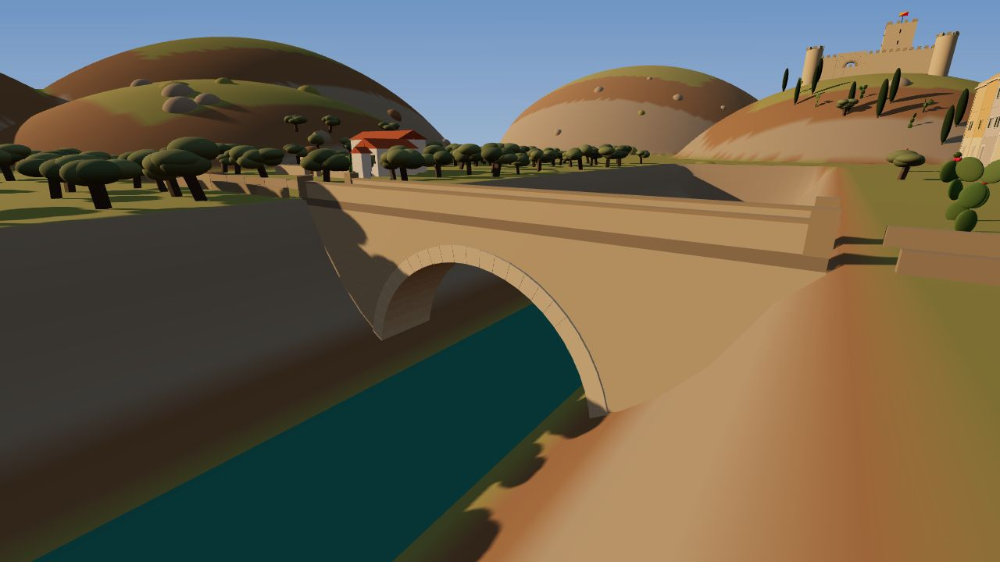 |

*These are offline previews of the generated geometry (three.js, simplified lighting). In Studio you'll see Roblox materials, Future lighting, terrain water and the golden-hour sky.*

## What's in it

**Movement** (`src/client/Movement.luau`, `CameraFX.luau`)
- Relaxed walk by default (10 studs/s). **Hold Shift** to run (23), with a smooth ramp in both directions. Gamepad: click **L3** to toggle. Mobile: a **RUN** button.
- Momentum: input eases in and out, so starts, stops and turns have weight.
- The body turns smoothly toward the direction of travel, in wider arcs when running. It faces the camera in shift-lock and first person.
- Hard landings slow you down briefly. A short jump cooldown stops bunny-hopping.
- Camera: the FOV widens while running, the camera trails the body slightly, head-bob is synced to the footsteps, and there is a small tilt when strafing and a springy dip on landing. All of this sits on top of Roblox's default camera, so zoom, collision and gamepad/touch controls are unchanged.
- **Shift-lock moves to Ctrl** because Shift is now Run.

**Blocky R6 characters** (`src/server/Characters.luau`, `src/shared/R6.luau`)
- Every player spawns as a classic R6 rig wearing their own 2D shirt, pants, hats, hair, face and skin colours. Bundle body meshes and 3D layered clothing are dropped because they can't fit R6.
- **Existing NPCs are converted to R6 in place** (`RigConverter.luau`). They keep their Model, Humanoid, HumanoidRootPart, scripts, clothes and accessories. To leave one alone, tag it `KeepRig`.
- On death, characters ragdoll instead of falling apart.

**Procedural animation** (`src/client/Animator.luau`)
- Animates every R6 rig from its physics: idle breathing, walk, run (forward lean and arm pump), jump, fall (with flailing on long falls), landing squash, climb, swim, sit, and holding a tool.
- Characters lean into turns and heads look around. Your head follows the camera, and NPCs glance at players who walk past.
- Stride matches speed, so feet don't skate. Footsteps are synced to the steps and vary by floor material.
- No animation assets to upload. If one of your scripts plays an Action-priority animation (a sword swing, say), the upper body is left to it and the legs keep walking.

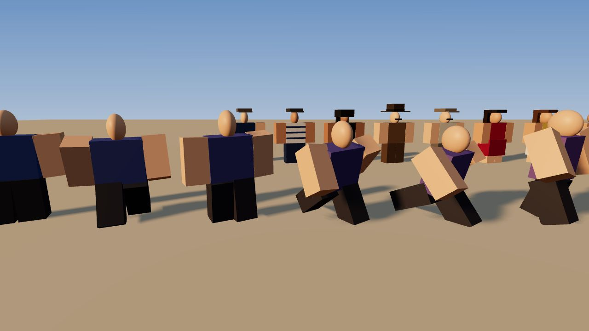

**The town** (`src/server/Town/`): Castelmare is generated from a fixed seed, so it's identical every time.
- **Piazza del Duomo**: a baroque cathedral with twin bell towers and majolica domes, a fountain, Garibaldi's statue, the market, the arcaded town hall (clock, flags) and a café arcade.
- **Via Roma**: string lights and shops with signs and awnings (Panificio, Trattoria, Tabacchi…), balconies, shutters, bougainvillea and parked Fiat 500s.
- **The harbour**: seawall with fishermen's boat arches, the belvedere and double staircase, quay, pier and lighthouse, colourful gozzo boats and the beach.
- **The countryside**: an old stone bridge over the river valley, a roadside shrine with candles, a masseria farmhouse, olive groves, vineyards and a lemon grove. A cypress-lined road leads up to the **Norman castle**.
- **Townsfolk**: fishermen in coppola caps, nonnas in black headscarves, a priest, vendors and tourists. They stroll the streets, work the market, sit at cafés and fish off the pier.

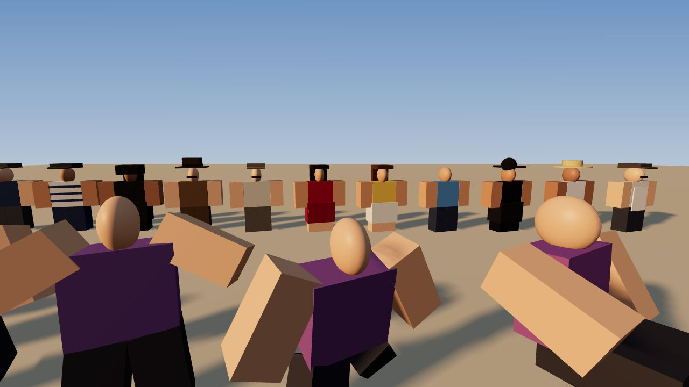

**Wild horses** (`src/server/Horses/`, `src/client/Riding.luau`, `HorseAnimator.luau`, `src/shared/Horse*.luau`)
- **Two saddled horses are tied up in the piazza**, a few steps from where you spawn (turn right from the cathedral view). Anyone can ride them.
- Five herds roam the meadows outside town, each with its own temperament (Calm, Spirited, Wild) and seven coats with markings. The nearest is a calm herd just east of town: look down the street from the piazza's south-east corner. Horses graze, wander, prick their ears when you come close and bolt from gunfire.
- **Press E to mount.** You climb on in one smooth motion; there's no teleport. The first ride on a wild horse is a taming: it bucks, spins and lunges while you **mash E** (Y / tap) to calm it. Keep the meter up and it's yours (it gets a saddle, and hearts pop up); let it slip and you're thrown off, then you can try again a moment later.
- Riding: **W** trots where the camera looks, **Shift** gallops (it costs stamina; a fresh press spurs a burst), **Alt** walks, **S** pulls up and then backs up, and **Space** jumps. The horse speeds up and brakes with weight, and turns wider the faster it goes. Slopes, steps and water (it swims) are handled.
- Every hoof is planted by a procedural gait (walk, trot, canter, gallop), so nothing skates. The rider posts at the trot and rises out of the saddle at the gallop. The camera pulls back and swings in behind the horse.
- **Whistle (H)** and your horse comes to you. Before you've tamed one, the whistle calls the nearest free saddled horse instead. Two more saddled horses wait at the stable by the west gate, and a ridden horse left alone for a while makes its own way back.

| | |
|---|---|
| 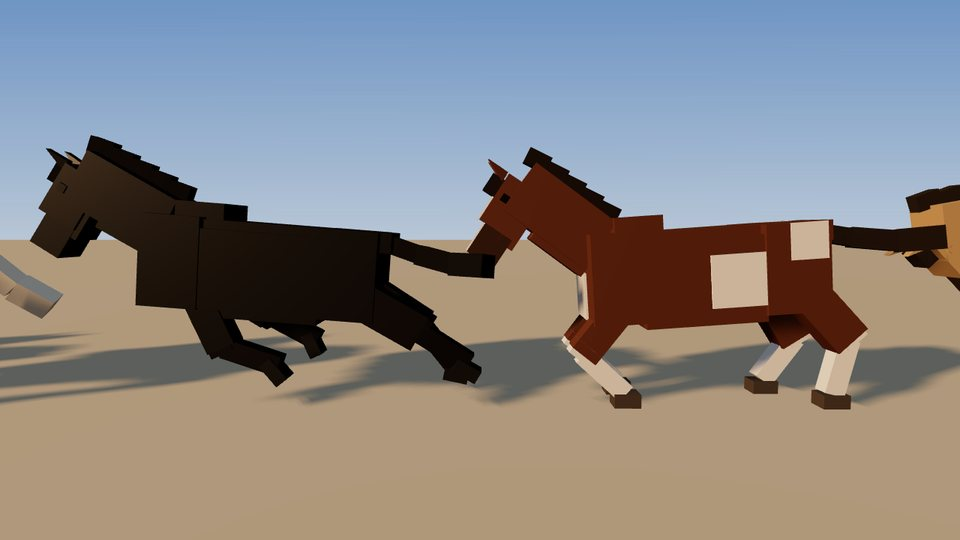 | 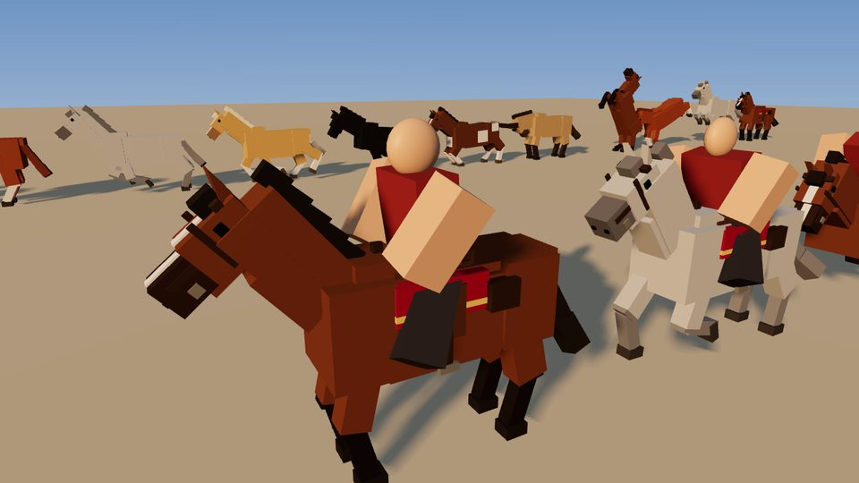 |

**Gunplay** (`src/client/Gunplay.luau`, `UpperBody.luau`, `WeaponFX.luau`, `CombatHud.luau`, `src/server/Combat/`, `src/shared/Weapons.luau`)
- Five guns on a gun belt: the **Cattleman** revolver (right hip), **Mauser** pistol (cross-draw on the left hip), **Carbine** lever-action repeater and **Carcano** bolt-action rifle (on the back), and the **Lupara** sawn-off shotgun (slung low). They're all built from parts and stay visible while holstered.
- **Hold RMB / L2** to aim over the shoulder, **LMB / R2** to fire. Hip-fire is quicker but spreads more. Moving, riding and firing fast widen the spread, and the crosshair shows the real spread. Every shot kicks the view.
- Each gun works its own action (hammer, lever, bolt, break-open) and reloads its own way: round by round, a stripper clip, or shells into the open breech. The free hand fetches rounds from the belt.
- Effects: muzzle fire and flash, smoke, the report with a canyon echo, faint bullet streaks, and impacts that match the surface (dust, stone chips, splinters, sparks, splashes). Bullet marks, spent casings, and people flinching where they're hit.
- **From the saddle:** draw, aim and shoot at a gallop. The horse keeps its pace while you aim (A/D steer it), your body turns toward the aim while your legs stay in the stirrups, and the camera goes over the shoulder. Your horse flinches at the shots but stays under control.
- **Dead Eye (F / R3):** the world drains to sepia and your heart thumps. Tap fire to paint marks on targets, then let go of aim to fire at each one in turn.
- **Cover (C / R1):** crouch behind low walls and crates (you rise to shoot over them), or stand against high cover.
- **Aim assist** on gamepad and touch only: a gentle snap when you start aiming, and light tracking.
- **Mobile:** FIRE (drag your thumb on it to keep aiming), AIM, GUN, RELOAD, DEAD EYE and COVER buttons.
- **Shooting range** by the west gate: bottles that shatter, cans that get knocked off their crates, and ammo crates to refill.
- **Server-authoritative:** the server tracks every gun's ammo, fire rate, draw and reload timing. It re-checks every hit before dealing damage: the muzzle is near the shooter, the fire rate is legal, the hit is on the bullet's path and in range, the struck part was really there (allowing for lag), and no wall is in the way. Damage always comes from the gun's stats, by body part and distance. Townsfolk panic at gunfire; wild horses bolt.

| | |
|---|---|
| 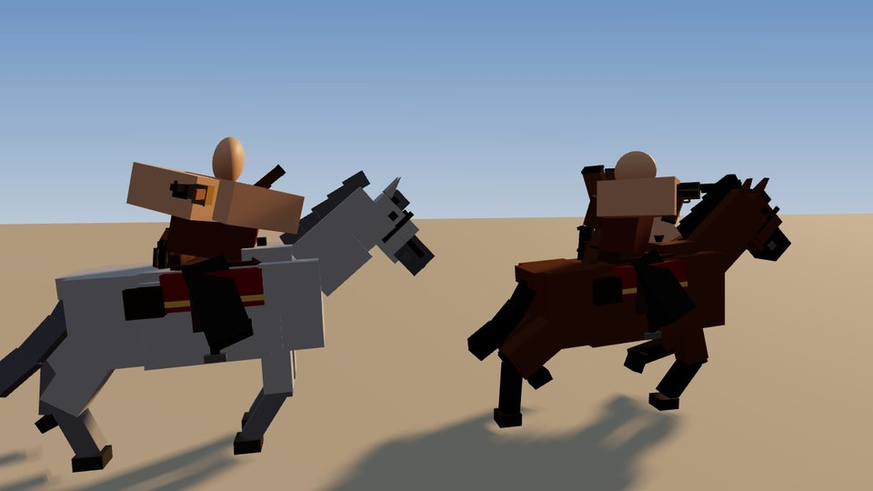 | 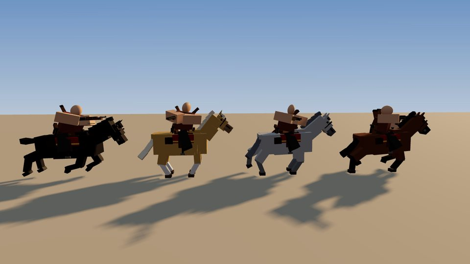 |
| 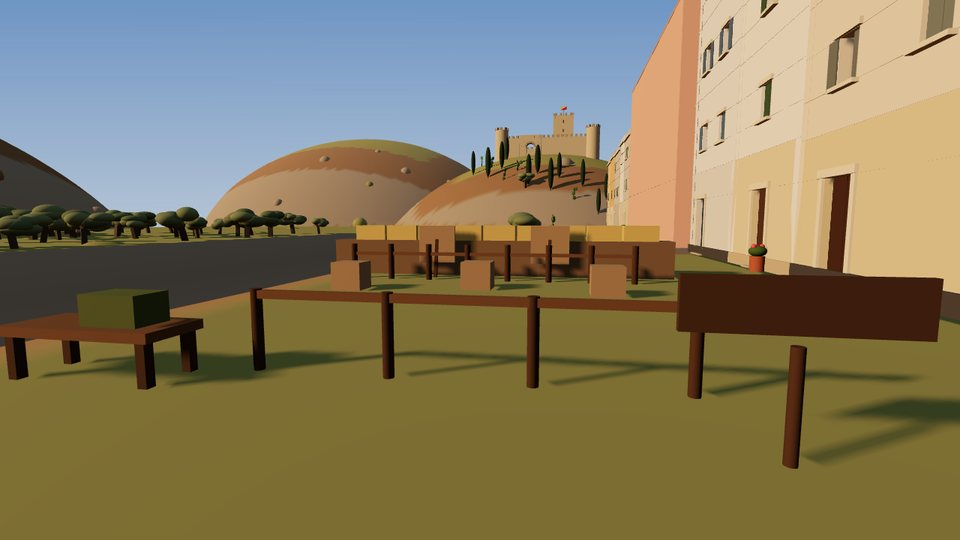 | |

**Presentation**: golden-hour lighting (plus `BlueHour` and `Midday` presets), a letterboxed intro flyover with a title card (any key skips it), a controls hint, a run vignette and a fade-in on respawn.

## Install into Place1

**Before you start**, back up Place1: File → Save to File As…

### Option A: drag-in installer (no tools needed)
1. In Studio's Explorer, right-click **ServerStorage** → **Insert from File…** → pick [`build/SicilyUpgrade.rbxm`](build/SicilyUpgrade.rbxm).
2. Open **View → Command Bar**, paste this and press Enter:
   ```lua
   require(game.ServerStorage.SicilyUpgrade.Install)()
   ```
   This moves the scripts into place and enables them. Anything it replaces (e.g. an old `Animate` script) is backed up to `ServerStorage.SicilyUpgrade_Backup`.
3. **Lighting → Technology → Future** in Properties. Scripts can't set this, and it's what makes the town glow.
4. Move your **old cowboy map** out of Workspace (drag it into ServerStorage) or delete it.
5. Press **Play**.

### Option B: Rojo
`default.project.json` maps `src/` into your place. Run `rojo serve` and connect with the Rojo plugin. Then do steps 3–5 above.

### Try it first
Open [`build/SicilyDemo.rbxl`](build/SicilyDemo.rbxl) in Studio and press Play. It's an empty place with everything installed.

### Optional: bake the town into your place
By default the town is generated when the server starts, which takes a few seconds and holds spawning until it's done. To see and hand-edit it in Studio, bake it once from the Command Bar, then save:
```lua
require(game.ServerScriptService.SicilyServer.Town).Bake()
```
When a baked `SicilianTown` model exists, the server reuses it instead of generating a new one. Re-run `Bake()` to regenerate it.

## Controls
| | Keyboard & mouse | Gamepad | Mobile |
|---|---|---|---|
| Run | hold **Shift** | click **L3** (toggle) | **RUN** button (toggle) |
| Shift-lock | **Ctrl** | — | — |
| Mount / dismount a horse | **E** | **Y** | tap the prompt / **DISMOUNT** |
| Calm a wild horse (taming) | mash **E** | mash **Y** | mash **CALM** |
| Ride · gallop · walk | **W** · **Shift** · **Alt** | left stick · **L3** | stick · **RUN** |
| Horse jump | **Space** | **A** | jump |
| Whistle for your horse | **H** | D-pad up | — |
| Aim | hold **RMB** (gun out) | hold **L2** | **AIM** (toggle) |
| Shoot (draws when holstered) | **LMB** | **R2** | **FIRE** |
| Reload | **R** | **X** | **RELOAD** |
| Pick a gun | **1–5**, **Q** | D-pad left / right | **GUN** |
| Holster | **X** (or the same number) | D-pad down | **GUN** after the last gun |
| Dead Eye | **F** | **R3** | **DEAD EYE** |
| Take / leave cover | **C** | **R1** | **COVER** |
| Skip intro | any key | any button | tap |

With guns holstered, RMB turns the camera as usual; with a gun out, the mouse steers the camera directly.

## Settings
Everything is in **`ReplicatedStorage.SicilyShared.Config`**. The most useful settings:

| Setting | Default | |
|---|---|---|
| `Movement.WalkSpeed` / `RunSpeed` | 10 / 23 | walk and run speed |
| `Movement.Acceleration` / `Deceleration` | 6.5 / 8.5 | lower = heavier |
| `Movement.Stamina.Enabled` | false | stamina-limited running |
| `Movement.ShiftLockKeys` | `"LeftControl,RightControl"` | `""` keeps Roblox's default |
| `Camera.RunFOV`, `WalkBob`, `RunBob` | 79, 0.03, 0.1 | camera feel |
| `Characters.KeepClothing` / `KeepAccessories` | true | what players keep from their avatar |
| `Characters.ConvertExistingNPCs` | true | R6-convert NPCs already in the place |
| `Town.Enabled` | true | turn off to keep your own map |
| `Town.HideOnBuild` | `{}` | names of old map models to move out of Workspace at runtime |
| `Town.TownsfolkCount` | 20 | strolling NPCs (plus vendors, café regulars and fishermen) |
| `Lighting.Preset` | `"GoldenHour"` | also `"BlueHour"`, `"Midday"` |
| `Lighting.DayNightCycle` | false | lamps switch on at dusk when enabled |
| `Intro.Enabled` / `Title` | true / `"CASTELMARE"` | opening flyover |
| `Horses.Herds` | 4 herds | where wild horses graze, how many, their temperament |
| `Horses.StableHorses` / `PiazzaHorses` | 2 / 2 | saddled horses at the stable and tied up in the piazza |
| `Combat.Loadout` | 5 guns | ids from `SicilyShared.Weapons` (keys 1–5) |
| `Combat.PvP` / `DamageTownsfolk` | true / true | who can be shot |
| `Combat.DeadEye`, `AimAssist`, `Cover` | on | the extras (`Enabled = false` turns one off) |
| `Combat.Sounds` | `""` | real gunshot / reload sound ids (see below) |

**Guns** live in **`ReplicatedStorage.SicilyShared.Weapons`**: damage, head/limb multipliers, range and falloff, fire rate (aimed and hip), magazine, reserve, reload type and timing, draw time, spread, recoil, aim FOV and aim assist. To add a variant, inherit from a gun and change only what differs:
```lua
Weapons.Defs.Schofield = { Inherit = "Cattleman", DisplayName = "Schofield Revolver", Damage = 42 }
```
Then add its id to `Config.Combat.Loadout`. Horse temperaments (speeds, turning, stamina, taming difficulty) and coats are in `SicilyShared.HorseTypes`.

**Sounds:** everything here uses only assets that ship with Roblox, so nothing needs uploading. The gunshots are a stock explosion clip, sped up and trimmed, with an echo. They work, but real western sounds are much better. Paste sound ids from the Creator Store into `Config.Combat.Sounds` (per gun class, plus reload, cock, impact, ricochet and a Dead Eye loop) and `Config.Horses` (hooves, snort, neigh).

## Working with your existing game
- **Speed changes from your scripts:** set attributes on the Humanoid rather than `WalkSpeed`, because the controller sets `WalkSpeed` every frame. Use `SpeedMultiplier` (e.g. `0.5` while aiming) and `MovementLocked` (true freezes input).
- **Old sprint or movement scripts** will fight this system, so remove them.
- **R15 animations** won't play on R6 rigs; re-make any you need for R6. Action-priority tracks still override the upper body.
- **Scripts that look up R15 part names** (`UpperTorso`, `LeftHand`…) need the R6 names (`Torso`, `Left Arm`…).
- **Spawns:** players always land in the piazza. To keep your own spawn logic, set `Town.UseTownSpawns = false`.
- **Hooking into combat:** server scripts can listen with `Combat.OnGunshot(function(position, shooter) end)` and `Combat.OnHit(function(instance, from, shooter) end)`, and refill a player's reserve ammo with `Combat.Refill(player)` (the Combat module is `ServerScriptService.SicilyServer.Combat`). Guns aren't Tools, so they don't use the Backpack.
- **Performance:** the generated town is about 20k anchored parts and ~200 lights, with terrain for the land and sea. It works with StreamingEnabled. Most small trim skips collision and shadows. To trim further, lower `Town.TownsfolkCount` or bake and then delete the areas you don't need.

## Project layout
```
src/shared/     Config, R6 rig builder, Spring, Remotes
                horses: HorseTypes, HorseRig, HorseGait, HorseMotor, HorseMount, Taming
                guns: Weapons, WeaponModels, AimRig, Ballistics
src/server/     boot script, Characters, RigConverter, Ragdoll, NPCs, LightingPreset, CollisionGroups
src/server/Town Plan (layout + terrain recipe), Landscape, Streets, Buildings, Facade,
                Landmarks, Harbour, Countryside, Props, Nav, Kit, Palette, Rng
src/server/Horses   herds, taming, ownership (init) and the riderless AI (Brain)
src/server/Combat   loadouts, ammo, hit validation, damage (init) and the shooting range (Targets)
src/client/     Movement, CameraFX, Animator, Sounds, Hud, Intro, Fx
                horses: HorseAnimator, Riding, RideHud
                guns: Gunplay, UpperBody, WeaponFX, CombatHud, CombatTouch, AimAssist, DeadEye, Cover
src/overrides/  empty Animate / RbxCharacterSounds that replace Roblox's defaults
tools/          offline checks (Lune), preview renderer (three.js), installer, build script
```

## Development
`tools/build.sh` builds the installer and demo place with [Rojo](https://rojo.space) and runs the offline checks with [Lune](https://lune-org.github.io/docs):
- `tools/lune/build-town.luau` runs the real generator against the built place. Lune validates every property, enum and value type against Roblox's API, and the script prints part, light and NPC-spot counts.
- `tools/lune/test-characters.luau` checks the R6 rig and drives the real animation solver through every state, checking foot contact. It also builds every townsfolk outfit and converts a mock R15 NPC in place.
- `tools/lune/test-horses.luau` runs the gait solver through every gait, turns, slopes and steps, and fails on sliding, floating or popping hooves. `test-riding.luau` checks the horse's handling, taming difficulty and herd AI. `test-horse-spawn.luau` generates the town and starts the real server horse module on it: every herd, stable and piazza horse must end up in the world on dry ground, and the piazza horses and nearest herd close to the spawn.
- `tools/lune/test-weapons.luau` builds every gun and checks the aim maths. `test-gunplay.luau` drives the real animation layer through draws, cross-draws, aiming, reloads, switching, mounted aiming (the legs must not move), cover and hit reactions. `test-combat.luau` runs the real server combat module against fake players: fire rate, ammo, damage by body part, every hit-validation rule, reloads, Dead Eye and the range targets.
- `tools/preview/render.mjs` renders the preview shots above (`npm install` in `tools/preview`, then `node render.mjs <dir with town.json>`).

These checks run outside Roblox. The town generator, animation, gait and combat logic are exercised for real, but the in-engine parts (the PlayerModule hook, camera, input, spawning, physics, terrain fills, NPC walking, network timing and effects) run for the first time in your Studio. If anything errors, the Output window will say which `[Sicily]` module failed. Test multiplayer with **Test → Clients and Servers** (2 players) to try PvP and mounted combat.
